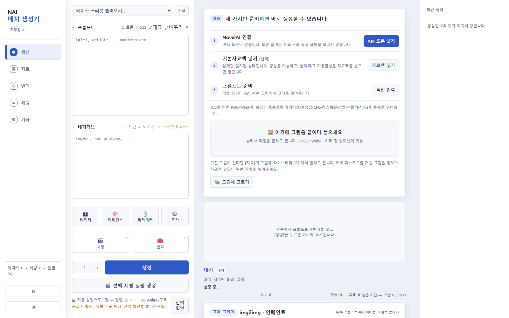
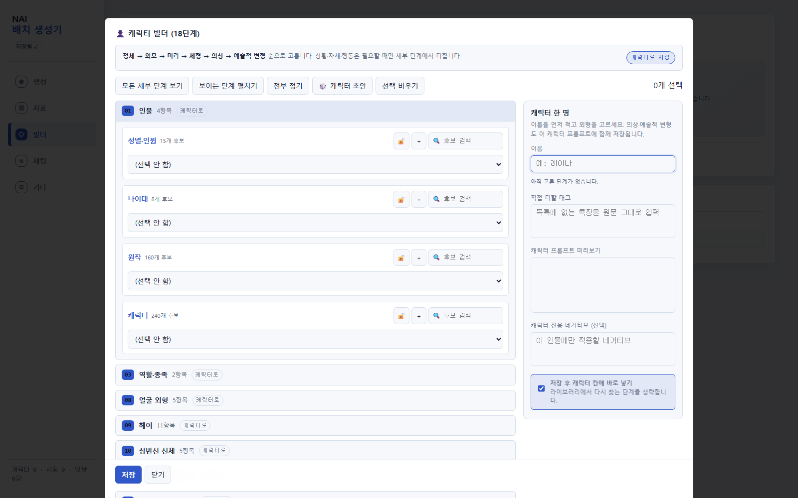
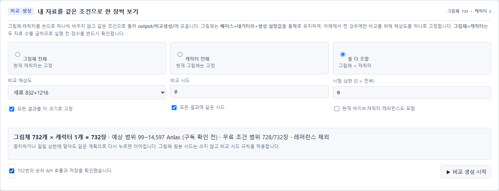
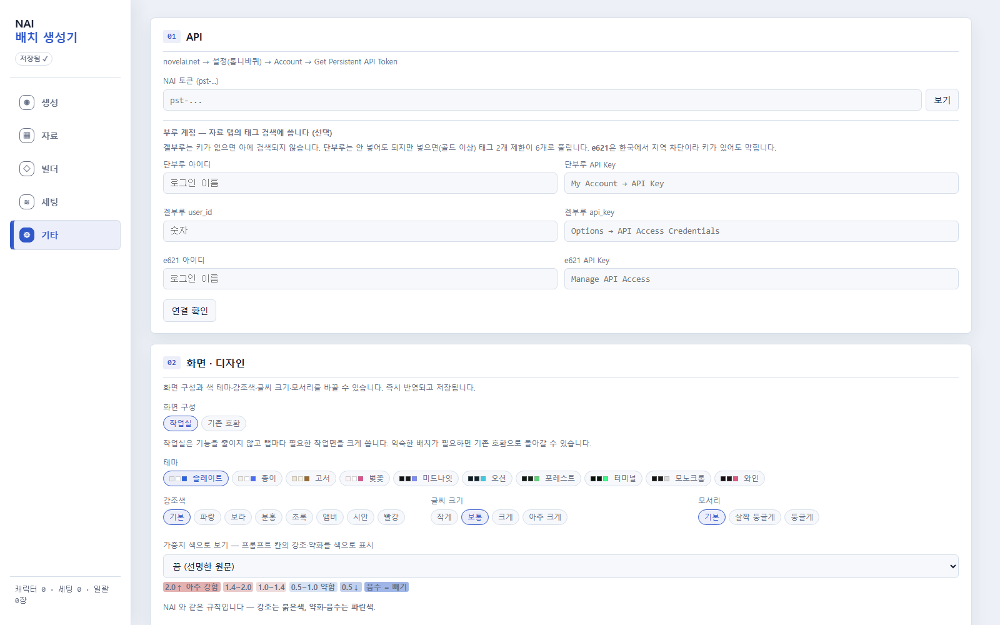

# NAI 배치 생성기

NovelAI 이미지 생성, 캐릭터·그림체 조립, 반복 비교와 결과 정리를 한곳에서 하는
Windows용 비공식 보조 프로그램입니다.

> NovelAI의 공식 제품이 아닙니다. 생성에는 사용자의 NovelAI 계정과 Persistent API
> Token이 필요하며, 호출 비용과 구독 조건은 NovelAI 정책을 따릅니다.

## 다운로드

[최신 Release](https://github.com/chikzon/nai-batch-generator/releases/latest)에서 다음
파일을 받습니다.

| 파일 | 누구에게 알맞은가 |
| --- | --- |
| `NAI-batch-generator-1.0.0-setup.exe` | 일반 사용자 권장. 설치·제거가 가능한 Windows x64 설치본 |
| `NAI-batch-generator-1.0.0-portable-win-x64.zip` | 설치하지 않고 원하는 폴더에서 쓰려는 사용자 |
| `NAI-batch-generator-1.0.0-datapack.zip` | 빌더 후보와 태그 검색·자동완성을 함께 쓰려는 사용자 |
| `SHA256SUMS.txt` | 받은 파일이 Release 원본과 같은지 확인할 때 사용 |

받은 파일 이름은 영문입니다. 프로그램을 설치·실행하면 화면과 폴더 이름은 한국어입니다.

설치본에는 아직 코드 서명이 없으므로 Windows SmartScreen이 경고할 수 있습니다.
Release의 SHA-256을 확인한 뒤 실행하세요.

### 처음 3단계

1. 설치본을 실행하거나 포터블 ZIP을 푼 뒤 `NAI배치생성기.exe`를 실행합니다.
2. 열린 화면에서 `기타 → API`에 NovelAI Persistent API Token을 넣습니다.
3. 기본자료팩을 받았다면 `자료 → 자료 넣기`에 ZIP 그대로 끌어다 놓습니다.

그다음 `생성` 탭에서 프롬프트를 넣고 생성하면 됩니다. 프로그램 창에는 로컬 서버의
상태와 주소가 표시되므로 사용하는 동안 닫지 마세요.

토큰은 계정 열쇠입니다. 다른 사람에게 보내거나 화면에 노출하지 마세요. 이 저장소,
설치본과 기본자료팩에는 개인 토큰이 들어 있지 않습니다.

## 화면

첫 실행에서는 필요한 순서를 화면 안에서 안내합니다.



기본자료팩을 넣으면 캐릭터를 단계별로 만들 수 있고, 전체 그림체·캐릭터 조합을 같은
조건으로 비교하기 전에 실제 호출 수와 예상 비용을 확인합니다.

| 캐릭터 빌더 | 비교 생성 계획 |
| --- | --- |
|  |  |

화면 구성, 테마, 강조색, 글씨 크기와 모서리는 `기타 → 화면·디자인`에서 바꿀 수 있습니다.



## 무엇을 할 수 있나

| 작업 | 제공 기능 |
| --- | --- |
| 생성 | 일반 생성, img2img, 인페인트, 바이브, 캐릭터 레퍼런스, 디렉터 툴, 업스케일 |
| 조립 | 베이스·캐릭터 빌더, 태그 검색, 그림체의 프롬프트+네거티브+생성 설정 묶음 저장 |
| 반복 | 세팅, 가벼운 씬 목록, 그림체·캐릭터·조합 비교 생성, 중지 후 이어하기 |
| 정리 | 생성물 탐색, 선별·즐겨찾기·비교함, 별점·판단 태그, 복구 가능한 휴지통 |
| 복원 | PNG/WebP 메타데이터 읽기, 같은 설정으로 재생성, 전체 사용자 자료 백업·복원 |

### 그림체와 캐릭터를 섞지 않습니다

- **그림체**는 베이스 프롬프트, 네거티브, 모델·CFG·리스케일·스텝·샘플러·해상도 등
  생성 설정이 함께 움직이는 한 묶음입니다.
- **캐릭터**는 캐릭터별 전체 프롬프트와 전용 네거티브를 보존합니다.
- **세팅**은 장면의 단계와 옵션을 묶어 여러 장을 계획적으로 생성합니다.

프롬프트가 512 T5 토큰을 넘어도 입력·저장 원문을 임의로 자르지 않습니다. 화면의 토큰
수는 베이스+캐릭터, 네거티브+캐릭터 네거티브가 각각 같은 모델 문맥을 쓴다는 점을 함께
표시합니다.

## 본체와 개인 자료

설치본과 포터블 본체에는 실행에 필요한 코드·런타임·문서만 들어갑니다.

- 공개 기본자료팩: 빌더 후보, 규격·옵션, 태그 CSV
- 개인 자료: 캐릭터, 그림체, 세팅, 레시피, 이미지 캐시, 생성물, 계정 설정
- 공개 기본자료팩에 **개인 세팅과 API 토큰을 자동으로 넣지 않습니다.**

설치본의 개인 자료는 `%LOCALAPPDATA%\NAI배치생성기\데이터`에 저장되므로 프로그램
제거·재설치와 분리됩니다. 다른 위치를 쓰려면 다음 옵션을 사용할 수 있습니다.

```text
NAI배치생성기.exe --data-dir "D:\NAI 개인 자료"
NAI배치생성기.exe --portable
NAI배치생성기.exe --no-browser
```

자료팩은 `manifest.json`과 각 파일의 SHA-256을 확인한 다음 넣습니다. 같은 팩을 다시
넣어도 기존 개인 자료를 기본적으로 덮어쓰지 않으며, 장착 기록에서 새로 들어온 파일만
되돌릴 수 있습니다.

## 알아둘 제한

- Windows x64와 한국어 UI만 지원합니다.
- 자동 업데이트와 스트리밍 중간 미리보기는 아직 없습니다.
- 단부루 비로그인 검색은 태그 2개까지이며, 계정을 연결하면 계정 등급 범위에서 늘어납니다.
- 태그 사전의 첫 색인은 PC에 따라 약 15초가 걸릴 수 있으며 이후에는 디스크 캐시를 씁니다.
- 중지는 다음 요청과 로컬 저장을 막지만 NAI 서버가 이미 받은 현재 요청의 처리·과금까지
  취소됐다고 보장하지 않습니다.
- 장시간 대량 생성과 밴 예방 설정의 실효성은 계정·네트워크 조건마다 다르므로 작은 묶음부터
  시험하세요.

더 세부적인 미지원 항목은
[Issues](https://github.com/chikzon/nai-batch-generator/issues)에서 관리합니다.

## 소스에서 실행·검증

일반 사용자는 Python이나 Node.js를 설치할 필요가 없습니다. 개발·검증할 때만 필요합니다.

```powershell
python -m pip install -r requirements.txt
python start.py
```

무과금 회귀 검사는 Python 3.10+와 Node.js 24를 사용합니다. Node는 렌더된 JavaScript의
구문을 검사할 때만 사용합니다.

```powershell
python 검증.py
```

Windows 실행본과 설치본은 다음처럼 만듭니다.

```powershell
python -m pip install pyinstaller==6.21.0
python 빌드.py --설치본
```

설치본 빌드에는 Inno Setup 6이 필요합니다. Git 태그 `v*`를 push하면 GitHub Actions가
고정된 출처에서 태그 CSV와 T5 토크나이저를 받고 SHA-256을 확인한 뒤 회귀 검사, 포터블,
기본자료팩과 설치본을 순서대로 만들어 Release에 게시합니다.

## 라이선스와 출처

프로그램 코드는 [GPL-3.0](LICENSE)입니다. 비교·참고한 다른 프로젝트와 작업 흐름은
[CREDITS.md](CREDITS.md), 배포 자료의 고정 출처·해시·라이선스는
[THIRD_PARTY_NOTICES.md](THIRD_PARTY_NOTICES.md)에 기록합니다.

다른 프로젝트의 기능 이름만 복제하지 않고, 현재 앱의 세팅·자료 분리·복구 구조에 맞게
다시 구현하는 것을 원칙으로 합니다.
