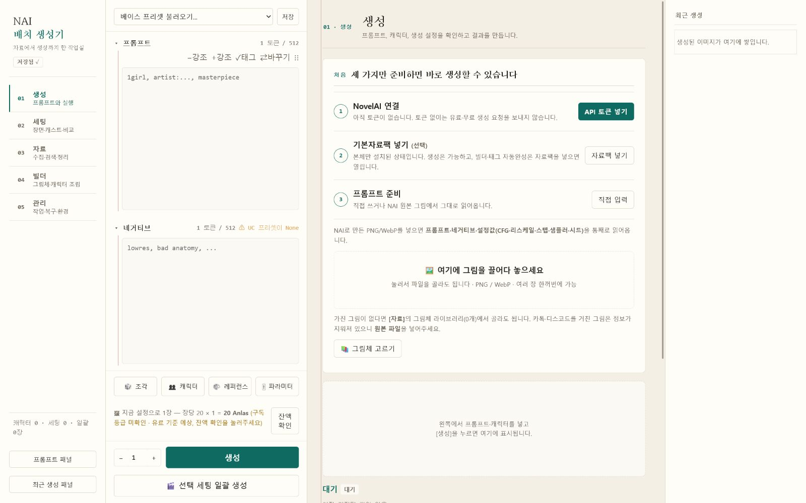
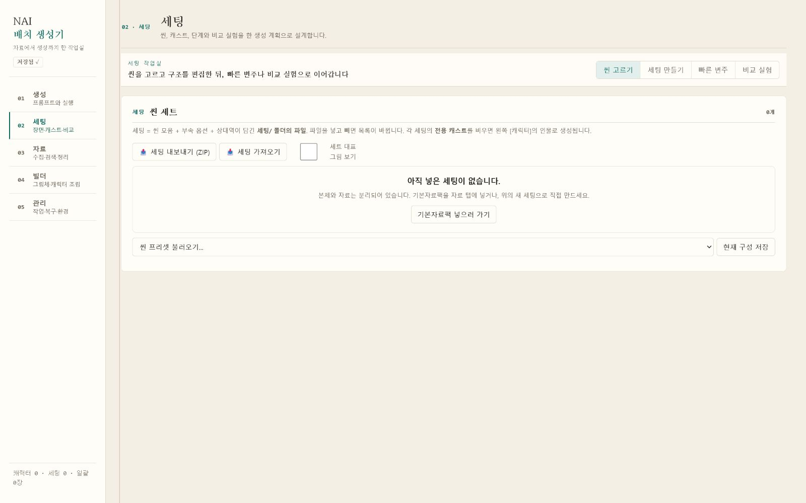
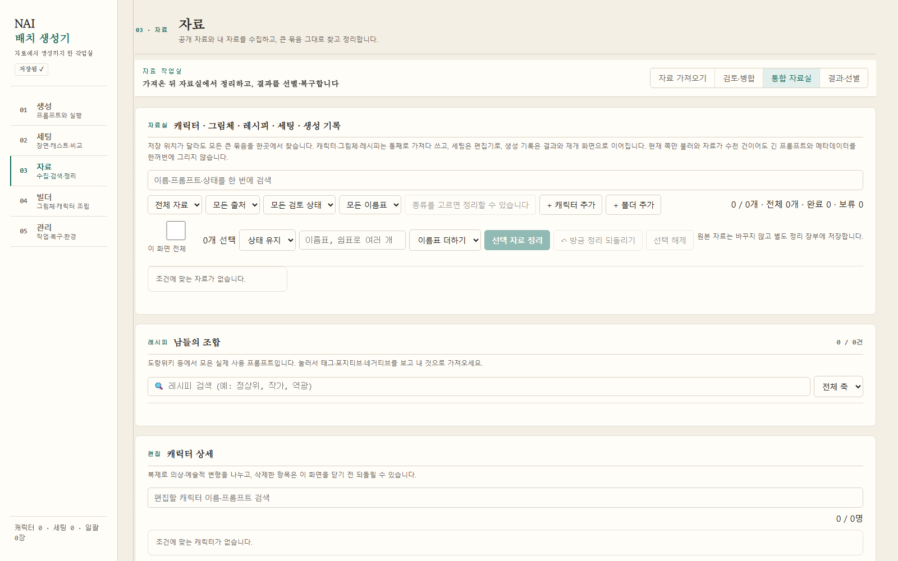
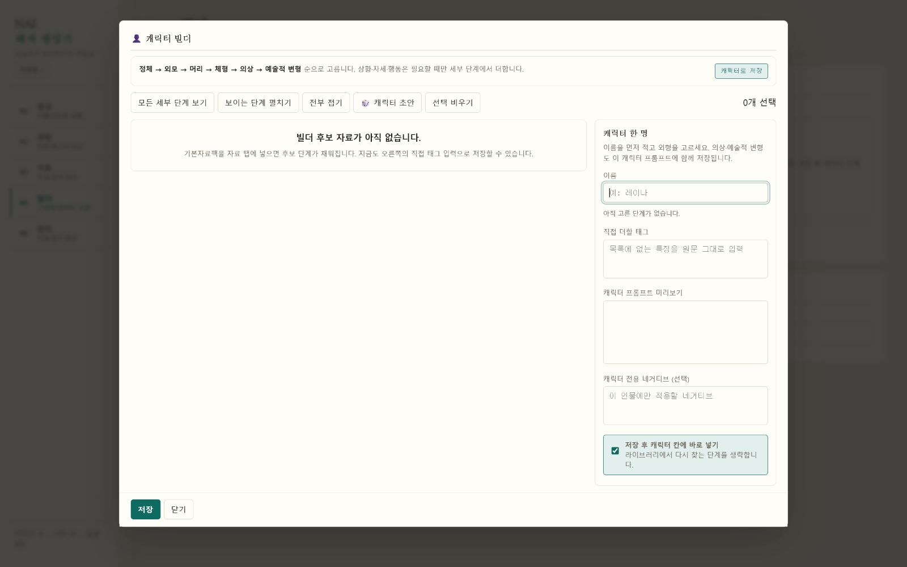
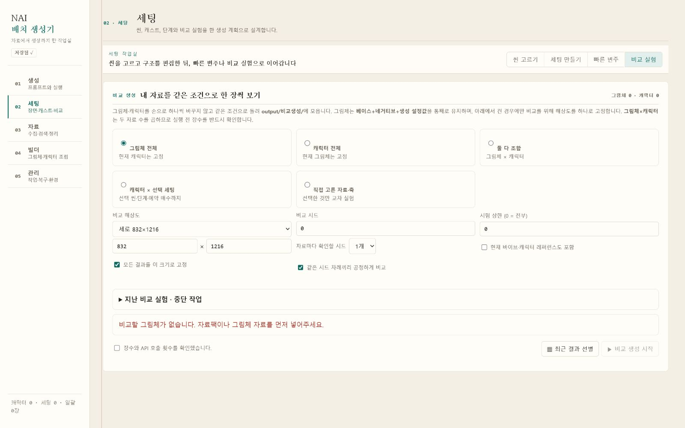
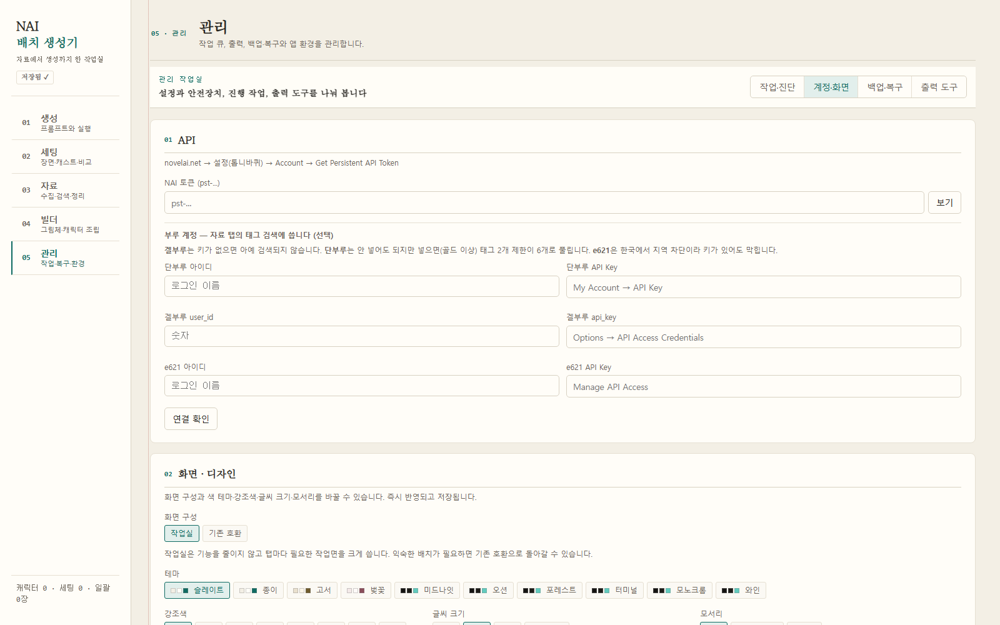
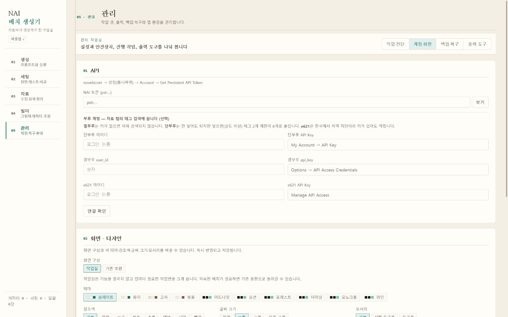

# NAI 배치 생성기

NovelAI 이미지 생성부터 자료 정리, 그림체·캐릭터 제작, 장면 설계와 반복 비교까지
한곳에서 이어 쓰는 Windows용 비공식 NAI 통합 작업실입니다.

화면 순서는 실제 작업 흐름에 맞춰 **생성 → 세팅 → 자료 → 빌더 → 관리**로 구성됩니다.

> NovelAI의 공식 제품이 아닙니다. 이미지 생성에는 사용자의 NovelAI 계정과
> Persistent API Token이 필요하며, 호출 비용과 이용 조건은 NovelAI 정책을 따릅니다.

## 안정판과 개발본

| 구분 | 용도 | 상태 |
| --- | --- | --- |
| [`v1.1.0` Release](https://github.com/chikzon/nai-batch-generator/releases/tag/v1.1.0) | 일반 사용자용 안정판 | 설치본·포터블·기본자료팩·SHA-256 목록 공개 |
| `main` | 다음 안정판을 준비하는 개발 소스 | `v1.1.0` 이후 변경을 포함하며 Release 실행본과 동작이 다를 수 있음 |

다운로드 파일명은 **`v1.1.0` 안정판 기준**이고, 아래 화면은 **현재 `main` 개발본**을
빈 사용자 데이터 폴더에서 실행해 촬영했습니다. `main`의 최신 화면이 보인다고 해서
새 Release가 게시됐다는 뜻은 아닙니다.

## 다운로드와 첫 실행

[Releases](https://github.com/chikzon/nai-batch-generator/releases)에서 필요한 파일을
받습니다.

| 파일 | 내용 |
| --- | --- |
| `NAI-batch-generator-1.1.0-setup.exe` | Windows x64 설치·제거가 가능한 권장 설치본 |
| `NAI-batch-generator-1.1.0-portable-win-x64.zip` | 설치 없이 압축을 풀어 실행하는 포터블판 |
| `NAI-batch-generator-1.1.0-datapack.zip` | 빌더 후보·규격·옵션·태그 검색 자료 |
| `SHA256SUMS.txt` | 위 세 파일의 SHA-256 확인 목록 |

1. 설치본을 실행하거나 포터블 ZIP을 풉니다.
2. `NAI배치생성기.exe`를 실행합니다.
3. `관리 → API`에 본인의 NovelAI Persistent API Token을 입력합니다.
4. 기본자료팩을 사용할 경우 `자료 → 자료 넣기`에 ZIP을 그대로 끌어다 놓습니다.
5. `생성`에서 프롬프트와 생성 설정을 확인한 뒤 생성합니다.

기본자료팩은 선택 사항입니다. 본체만으로 생성할 수 있고, 자료팩을 넣으면 태그
검색·자동완성과 기본 빌더 후보가 채워집니다.

설치본은 아직 코드 서명이 없어 Windows SmartScreen 경고가 나타날 수 있습니다.
Release의 `SHA256SUMS.txt`와 받은 파일의 해시를 대조한 뒤 실행하세요.

Persistent API Token은 계정 열쇠입니다. 공개 화면이나 다른 사람에게 보내지 마세요.
저장소·설치본·포터블·기본자료팩에는 개인 토큰이 들어 있지 않습니다.

## 화면

동일한 1600×1000 화면 크기와 빈 사용자 데이터로 촬영했습니다. 개인 토큰·자료·생성
이미지는 들어 있지 않습니다. 촬영 이후 `자료` 탭에 검토·병합 흐름이,
`관리` 탭에 새 버전 확인 카드가 추가되어 실제 개발본에는 카드가 몇 개 더 보입니다.

### 생성과 세팅

| 첫 실행·생성 | 세팅 작업실 |
| --- | --- |
|  |  |

### 자료와 빌더

| 통합 자료실 | 캐릭터 빌더 |
| --- | --- |
|  |  |

### 비교와 관리

| 비교 실험 | 작업·진단 |
| --- | --- |
|  |  |

테마, 강조색, 글씨 크기, 모서리와 화면 구성을 `관리 → 계정·화면`에서 조절합니다.



## 현재 구현 기능

### 1. 생성

- Base·Negative 원문 입력과 캐릭터별 Prompt·Negative
- AI 자동·위치판·자유 좌표 중 선택하는 다중 캐릭터 위치 지정
- 모델, 해상도, Seed, Steps, Sampler, Noise Schedule, CFG·Rescale, 품질 계열 설정
- 생성 전 토큰 수·예상 Anlas 확인
- PNG·WebP 메타데이터에서 프롬프트·캐릭터·생성 설정 복원
- Character Reference와 Vibe 등록·선택, Vibe 인코딩
- 단일 생성, 최근 결과, 결과에서 같은 설정 다시 적용
- img2img, Inpaint, Outpaint, Director 도구, 업스케일

긴 프롬프트는 저장·불러오기·복사 과정에서 임의로 자르지 않습니다. 화면의 토큰 표시는
Base와 캐릭터 Prompt, Negative와 캐릭터 Negative가 각각 같은 NAI 문맥을 공유한다는
기준으로 계산합니다.

### 2. 세팅

- 장면, 단계, 옵션, 역할과 캐스트를 재사용 가능한 생성 계획으로 저장
- 캐릭터별 Prompt·Negative·위치·Reference·Vibe 연결
- 캐스트 순회와 동시 출연 계획
- 장면별 추가·제외값, 상대역, 단계 순서와 반복 수 관리
- 그림체 전체, 캐릭터 전체, 그림체×캐릭터와 선택 자료 비교 실험
- 비교 Seed·해상도 고정, 다중 Seed, 실행 전 장수·비용 계산
- 비교 중지·재개·실패 재시도와 선택한 한 셀 재생성
- 비교 결과를 생성 설정과 그림체·캐릭터 자료로 다시 연결

전수 비교는 별도 도구가 아니라 세팅에 붙는 실험 규칙으로 다룹니다.

### 3. 자료

- 단건·다중 이미지의 NAI 메타데이터 복원과 대량 메타데이터 검사
- 공개 게시물의 이미지·원문 주소·메타데이터 수집, 중지·재개·변경 기록
- 로그인 게시물은 브라우저 전달(relay)로 수집 — 매 실행 발급하는 pairing
  code와 arca.live 출처 검증을 거치며 쿠키·비밀번호는 앱에 저장하지 않음
- 대형 archive 다운로드의 HTTP Range 이어받기 (`.part`+상태 기록,
  서버 내용이 바뀌면 처음부터)
- 자료팩 내용·해시·충돌 미리보기, 선택 반영과 장착 단위 되돌리기 —
  설치는 staging과 작업 journal을 거쳐 중단돼도 다음 실행에서
  이어서 완료하거나 전체 되돌아감
- 백업·자료팩·자료실 중복을 한 검토 흐름으로 보는 병합 미리보기,
  새 백업부터 `기준/현재/들어오는 값` 3-way 판정 표시
- 자료실 중복 그림체를 나란히 비교하고 대표 자산에 증거만 비파괴 병합
  (원문은 그대로, 되돌리기 지원)
- 그림체·캐릭터·레시피·작가·세팅 자료를 함께 찾는 통합 자료실
- 폴더·출처·검토 상태·별점·메모·라벨을 이용한 검색과 정리
- 생성물 탐색기, 선별, 비교함, 이미지 월드컵과 블라인드 ELO
- 결과를 그림체·캐릭터·Reference·Vibe·img2img 입력으로 환류
- 로컬/원격 이미지 캐시, 중복·누락·변경 감사와 생성물 휴지통·복원

### 4. 빌더

- 그림체를 **Base + Negative + 생성 설정 + 근거 이미지** 묶음으로 저장
- 작가 수, 평점별 인원, 개별 가중치, 균일·무작위·곡선 가중치와 고정 작가 조합
- 캐릭터별 전체 Prompt·Negative와 후보 단계 조립
- 프롬프트 조각의 무작위·순차 재사용
- Danbooru/e621 태그 검색·자동완성, NAI 개명 태그·별칭·희소 태그 검증
- 이미지에서 복원한 값을 그림체·캐릭터 자산으로 규격화해 저장

### 5. 관리

- 단일 NAI 실행권, 작업 Queue, 진행·중지·재시도와 재시작 복구
- Request ID·Payload Hash·결과 계보를 포함한 실행 기록
- 계정별 토큰·설정·진행·출력을 나누는 프로필
- 출력 폴더, 호출 간격·휴식, 완료 알림과 진단 로그
- 사용자 자료 전체 백업, 파일·JSON 항목별 충돌 확인, 선택 복원과 되돌리기
- 중단된 복원·자료팩 설치를 다음 실행에서 자동으로 수렴(이어서 완료 또는
  전체 되돌리기)시키는 시작 복구
- 공식 GitHub Release만 확인하는 새 버전 검사 — `SHA256SUMS.txt`와 내용이
  일치할 때만 내려받기 완료로 처리하고, 설치는 설치 프로그램 화면에서
  직접 진행(자동·무인 설치 없음)
- 생성물 휴지통, 자료 무결성 검사와 프로그램 데이터 위치 이전
- 테마·강조색·글자 크기·화면 밀도 설정

## 본체·기본자료팩·개인 자료

| 구분 | 들어 있는 것 | 들어 있지 않은 것 |
| --- | --- | --- |
| 본체 | 실행 코드·런타임·UI·문서 | 개인 토큰, 캐릭터·그림체·세팅, 생성물, 대형 수집 자료 |
| 공개 기본자료팩 | 후보사전·규격·옵션·태그 CSV | 개인 세팅, 개인 이미지·캐시, API 토큰 |
| 개인 자료 | 설정·프로필·캐릭터·그림체·세팅·레시피·캐시·생성물 | Release와 Git 저장소에 자동 포함되지 않음 |

설치본의 사용자 데이터는 기본적으로 다음 위치에 저장됩니다.

```text
%LOCALAPPDATA%\NAI배치생성기\데이터
```

대용량 자료를 다른 드라이브에 두거나 포터블 데이터 모드를 명시하려면 다음 옵션을
사용합니다.

```text
NAI배치생성기.exe --data-dir "D:\NAI 개인 자료"
NAI배치생성기.exe --portable
NAI배치생성기.exe --no-browser
```

자료팩은 `manifest.json`과 파일별 SHA-256을 검사한 뒤 반영합니다. 기존 개인 자료를
조용히 덮어쓰지 않으며, 충돌은 미리 확인하고 선택합니다. 새로 들어온 자료는 장착
기록을 기준으로 되돌릴 수 있습니다.

## 현재 제한

- Windows x64와 한국어 UI만 지원합니다.
- 스마트폰 앱·PC 연동, 다국어 UI, 스트리밍 중간 미리보기는 없습니다.
- 새 버전 검사는 있지만 **자동·무인 설치는 하지 않습니다.** 내려받기와 설치는
  항상 사용자가 화면에서 확인한 뒤 진행합니다.
- Vibe와 Character Reference는 NAI 전송 규칙 때문에 동시에 활성화할 수 없습니다.
  앱은 어느 자료도 삭제하지 않고 전송 전에 선택을 요구합니다.
- 여러 파일을 바꾸는 작업(자료팩·병합)은 staging과 작업 journal로 중단 시
  복구를 보장하지만, 여러 파일이 한순간에 바뀌는 완전한 원자 커밋은 아닙니다.
- 3-way 기준값은 **새로 만든 백업부터** 실립니다. 구형 백업은 변환 없이
  기존 2-way 비교로 남습니다.
- 브라우저 전달 수집은 arca.live 게시물 전용입니다. 다른 사이트의 로그인
  수집은 지원하지 않습니다.
- 단부루 비로그인 검색은 태그 2개까지이며, 계정을 연결하면 계정 등급 범위에서
  늘어납니다.
- 태그 사전의 첫 색인은 PC에 따라 시간이 걸릴 수 있고, 이후에는 디스크 캐시를 씁니다.
- 중지는 다음 요청과 로컬 저장을 막지만 NAI 서버가 이미 받은 현재 요청의 처리·과금까지
  취소됐다고 보장하지 않습니다.

## 후속 로드맵

일정이 확정된 완료 목록이 아니라, 현재 구조를 유지하며 검토할 다음 후보입니다.

- 스마트폰 보조 앱과 PC 작업실 연결
- 이전 설치 데이터 미리보기
- 자료 충돌·증거 병합 검토 화면의 확장 (양쪽 원문 나란히 편집)
- 프로젝트·템플릿 계층 편집과 더 일반적인 실험 축
- 별도 UI 2차 재설계와 다국어 UI

기능 요청과 결함은 [Issues](https://github.com/chikzon/nai-batch-generator/issues)에
남길 수 있습니다.

## 소스에서 실행

개발본은 Python 3.10 이상에서 실행합니다.

```powershell
python -m pip install -r requirements.txt
python start.py
```

또는 Windows에서 `실행.bat`을 사용할 수 있습니다.

무과금 회귀 검증은 Python 3.10과 Node.js 24를 기준으로 합니다. Node.js는 렌더된
JavaScript의 구문 검사에 사용되며 일반 Release 사용자는 설치할 필요가 없습니다.

```powershell
python 검증.py
```

포터블 실행본과 설치본:

```powershell
python -m pip install pyinstaller==6.21.0
python 빌드.py --설치본
```

설치본 빌드에는 Inno Setup 6이 필요합니다. `v*` 태그를 push하면 GitHub Actions가
고정된 출처의 태그 CSV와 T5 토크나이저를 SHA-256으로 확인한 뒤 회귀 검사, 포터블,
기본자료팩, 설치본과 `SHA256SUMS.txt`를 Release에 게시합니다.

## 출처와 라이선스

- 프로그램 코드: [GPL-3.0](LICENSE)
- 참고한 프로젝트와 기능 흐름: [CREDITS.md](CREDITS.md)
- 배포 자료의 고정 출처·해시·라이선스: [THIRD_PARTY_NOTICES.md](THIRD_PARTY_NOTICES.md)

참고 프로젝트의 제품 구조를 그대로 복제하지 않고, 현재 앱의 생성 설계도·세팅·자료
분리·복구 흐름에 맞춰 다시 구현합니다.
